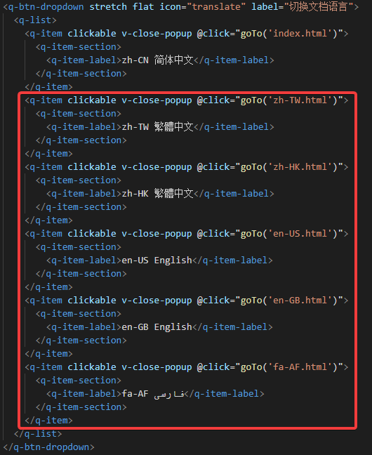

# fedora-wsl-manager-github-action-data-service
 The fedora-wsl-manager-github-action-data-service package provides data service of fedora-wsl-manager.
# Special thanks
 Data source: [docker-brew-fedora](https://github.com/fedora-cloud/docker-brew-fedora)
# fedora-wsl-manager-github-action-data-service Document
 Check out document: [fedora-wsl-manager-github-action-data-service Document](https://cnoctave.github.io/fedora-wsl-manager-github-action-data-service/index.html)
# How to translate fedora-wsl-manager-github-action-data-service Document into another language
 In ./docs directory, index.html is zh-CN simplified Chinese document. 
 For example, if you want to translate document into English.
 1. Copy index.html as another document with different language code as filename, 
 for example, en-US.html.
 2. Translate en-US.html into English.
 3. Add dropdown like the picture below to every *.html. 
 For example, add dropdown "en-US English".  
   
 The code for adding dropdown is like the picture below.  
  
 4. PR to fedora-wsl-manager-github-action-data-service.